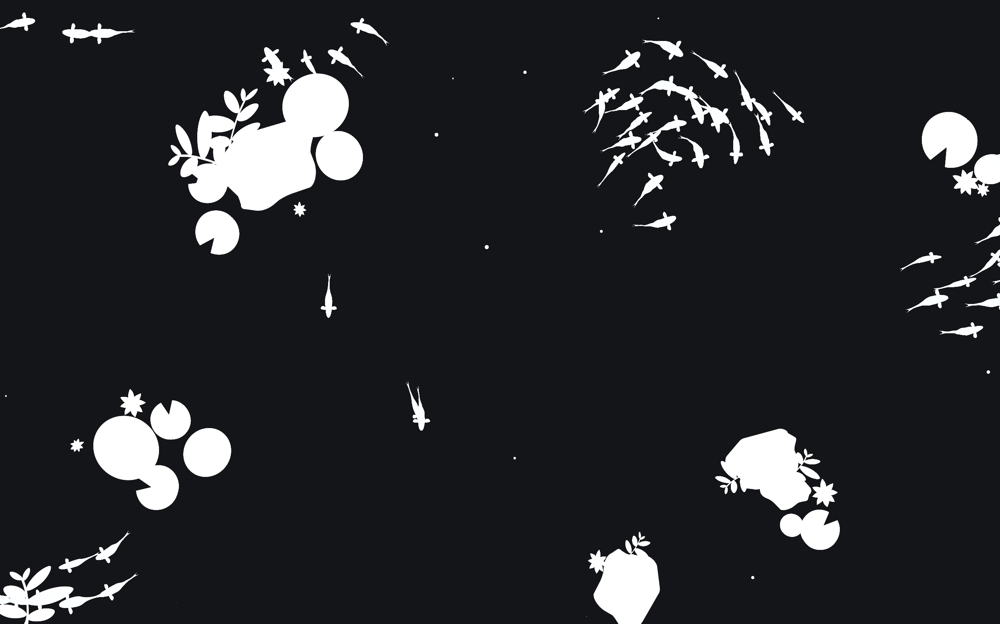

# Koi
A boid simulation using the rules of avoidance, cohesion and alignment
## About

### Description
Project "Koi" is a simple boid simulation using the rules of avoidance, cohesion and alignment based on this [resource](https://cs.stanford.edu/people/eroberts/courses/soco/projects/2008-09/modeling-natural-systems/boids.html). It simulates a small koi pond, where fishes swim around in a realistic motion and forms schools. There isn't much interactivity, but it is quite a mesmerizing sight to look at. 🤩
  
Features:

* Animated fishes, swimming in schools
* Fishes avoid obstacles, and swim around them
* Click on a point to create a disturbance, causing the fishes to scatter!

### Technology
* Unity: Game engine to run the simulation
* C#: Backend logic
## Getting Started
### Deployment
Download instructions for users (for Windows only):
1. Download [Release1.0.0.zip](https://github.com/AustinKong/koi/releases/tag/v1.0.0)
2. Unzip Release1.0.0.zip
3. Run 'Project Koi.exe'
### Dependencies
* Unity
### Installation
Installation and setup instructions for developers:
1. Install Unity Hub
2. Install Unity version 2020.3.30f1 or recommended LTS
3. Fork and clone the repository
4. Start coding and build something awesome!
### Contributing
This project is no longer under active development. Suggestions, issues and bug reports will not be actively resolved. However, pull requests and forks are always welcome!
## Help
### Controls
	Alt + F4 - Quit
	D - Toggle decorative objects (Does not affect simulation)
	R - Toggle obstacles (rocks)
	Left mouse button - Create a disturbance at cursor, causing fish to scatter
	
## Authors
Austin Kong [@AustinKong](https://github.com/AustinKong)   
Special thanks to BlackThornProd for [technique of animating fish](https://youtu.be/9hTnlp9_wX8)

## License
This project is licensed under MIT license. View license in [license.txt](license.txt)
